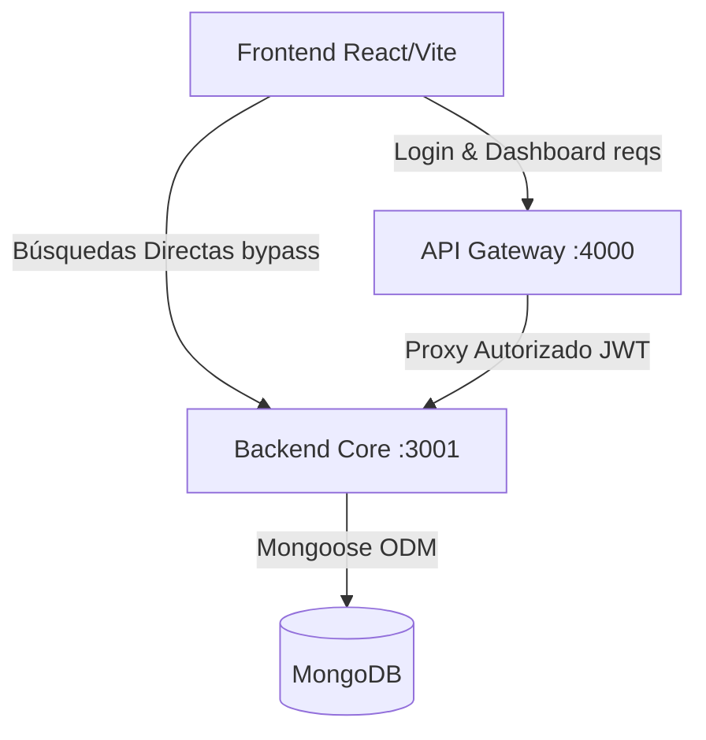
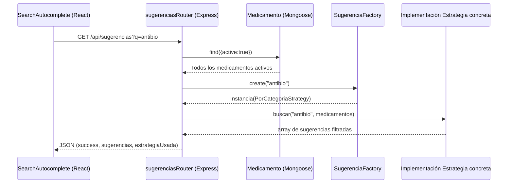

# Análisis Arquitectónico y Documentación Técnica del Proyecto Farmalink

Este documento presenta un análisis exhaustivo de la arquitectura de software implementada en el proyecto "Farmalink-SAS". El análisis se basa estrictamente en el código fuente proporcionado, evaluando el diseño del sistema, los patrones implementados, la separación de responsabilidades, el flujo de datos y la adherencia a paradigmas arquitectónicos convencionales.

---

## 1. Visión General de la Arquitectura del Sistema

El proyecto Farmalink-SAS implementa una arquitectura distribuida que se asemeja a un ecosistema de **Monolito Modular con un API Gateway**. No se trata de una arquitectura de microservicios puros, dado que el backend sigue siendo una aplicación unificada (monolito) que se conecta a una única instancia de base de datos. Sin embargo, abstrae el enrutamiento y la autenticación a través de una capa intermedia (Gateway).

### 1.1 Componentes Principales
1. **Frontend (Capa de Presentación):** Una SPA (Single Page Application) construida con React, TypeScript y Vite (`src/App.tsx`).
2. **API Gateway (Capa de Enrutamiento y Autenticación):** Un servidor Node.js/Express (`gateway/index.js`) que funciona en el puerto 4000. Se encarga de la generación de tokens JWT y la intermediación de solicitudes.
3. **Backend Core (Capa de Lógica de Negocio y Persistencia):** Un servidor Express/Mongoose (`backend/server.ts`) ejecutándose en el puerto 3001, responsable del acceso profundo a la base de datos y la lógica avanzada de búsquedas y sugerencias.
4. **Base de Datos:** MongoDB, accedida nativamente a través del ODM Mongoose.

---

## 2. Análisis del Patrón Arquitectónico: ¿MVC o Implementación Híbrida?

Al analizar el backend, **se concluye que la implementación es de naturaleza Híbrida** y no un patrón MVC (Modelo-Vista-Controlador) estricto.

### 2.1 Justificación a partir del Código
El patrón MVC dictamina una separación estricta:
- **Modelo:** Estructura y reglas de acceso a los datos.
- **Vista:** Interfaz de usuario (generalmente separada en APIs modernas enfocadas a REST).
- **Controlador:** Intermediario que procesa la entrada de la vista, invoca al modelo y retorna una respuesta.

En el código fuente de Farmalink, se observan diferencias arquitectónicas:
1. **Los Modelos están definidos:** Existe un directorio `backend/models/` (`Farmacia.ts`, `Medicamento.ts`, `Precio.ts`, `User.ts`) que modela los esquemas de Mongoose con precisión. Esto cumple con la capa 'M' de MVC.
2. **Ausencia de Controladores Aislados:** No existe un directorio `controllers/`. Las lógicas de negocio y el manejo de solicitudes (`req`, `res`) se resuelven directamente dentro del archivo principal `backend/server.ts` (rutas como `/api/farmacias` o `/api/dashboard`) o en enrutadores modulares como `backend/sugerencias/sugerenciasRouter.ts`.

Por tanto, la arquitectura de Farmalink agrupa el **Enrutamiento y el Controlador (Router-Controller)** en una sola capa funcional. Se la clasifica como una **Arquitectura Híbrida Orientada a Recursos Modulares**, donde módulos complejos (como `sugerencias`) se abstraen en subdirectorios, mientras que recursos simples se manejan a nivel de archivo raíz (`server.ts`).

---

## 3. Patrones de Diseño Detectados

El análisis del código revela una aplicación deliberada de Patrones de Diseño estandarizados (GoF - Gang of Four) para resolver problemáticas específicas en escalabilidad y mantenimiento.

### 3.1 Patrón Strategy (Estrategia)
**Ubicación:** `backend/sugerencias/strategies/`
- **Teoría:** El patrón Strategy permite definir una familia de algoritmos, encapsular cada uno en una clase separada y hacer sus objetos intercambiables. Esto permite que el algoritmo varíe independientemente del cliente que lo utiliza.
- **Implementación en el Código:** Existe una interfaz o clase base abstracta `SugerenciaStrategy` de la que heredan tres estrategias concretas:
  1. `CoincidenciaParcialStrategy`: Usada para búsquedas estructuradas por nombre (más de 3 caracteres).
  2. `PorCategoriaStrategy`: Usada si el motor detecta palabras clave que representan categorías médicas (ej. "analg", "antibio").
  3. `SimilitudBasicaStrategy`: Estrategia por defecto (fallback) si el query no cumple condiciones estrictas.
- **Justificación:** Se empleó para evitar condicionales complejos y enormes anidaciones de `if/switch` dentro del enrutador de sugerencias. Expresa alta cohesión y bajo acoplamiento al momento de agregar futuros criterios de búsqueda.

### 3.2 Patrón Factory Method (Método de Fábrica)
**Ubicación:** `backend/sugerencias/SugerenciaFactory.ts`
- **Teoría:** Proporciona una interfaz para crear objetos en una superclase, pero permite que las subclases alteren el tipo de objetos que se crearán.
- **Implementación en el Código:** La clase estática `SugerenciaFactory` implementa un método `create(query, tipo)` que evalúa semánticamente el `query` del usuario frente a una lista de *categoryKeywords* y decide automáticamente qué instancia de `SugerenciaStrategy` instanciar y retornar al `sugerenciasRouter.ts`.
- **Justificación:** Delega la responsabilidad algorítmica de decidir "qué estrategia usar" fuera del enrutador y del cliente. Encapsula la regla de negocio de decisión.

### 3.3 Patrón Singleton (Instancia Única)
**Ubicación:** `backend/shared/db.ts`
- **Teoría:** Garantiza que una clase solo tenga una instancia y proporciona un punto de acceso global a ella.
- **Implementación en el Código:** La clase `Database` maneja la conexión con Mongoose utilizando un constructor privado y un método `public static getInstance()`. Mantiene el estado interno `connected`.
- **Justificación:** Prevenir que múltiples solicitudes generen múltiples pools de conexión redundantes hacia MongoDB, lo que podría agotar los recursos del servidor y la base de datos.

---

## 4. Separación por Capas y Responsabilidades de Carpetas y Archivos

El sistema se divide orgánicamente en los siguientes dominios de responsabilidad:

### 4.1 Capa de Frontend (`/src`)
- `App.tsx`: Orquestador principal de UI. Maneja estados globales básicos (datos de farmacias, medicamentos y precios). Se comunica de forma dual (hacia el Gateway para datos de dashboard y _directamente_ al backend para el input predictivo de búsqueda).
- `components/SearchAutocomplete.tsx`: Componente rico y altamente interactivo. Implementa técnicas de "debounce" (300ms) para limitar carga en la red y optimizar las peticiones originadas por los eventos onChange del input.

### 4.2 Capa Middleware/Gateway (`/gateway`)
- `index.js`: Funciona como Proxy Inverso aplicativo. Contiene la lógica del endpoint `/api/auth/login` emitiendo web tokens (JWT). Posee una función middleware `validateJWT` que blinda el acceso al Monolito para rutas críticas. Al validar la solicitud, retransmite la carga utilizando Axios hacia `http://localhost:3001`.

### 4.3 Capa Múltiple de Backend (`/backend`)
- `server.ts`: Bootstrap del API. Inicializa middlewares globales (`cors`, `express.json`) e inyecta routers modulares (como `/api/sugerencias`). Provee enrutamiento crudo para peticiones REST estándar del dashboard.
- `models/`: Archivos ODM. Declaran esquemas de persistencia estricta de TypeScript mediante Mongoose, vinculando relaciones entre colecciones (ej. `Medicamento` refiere a `Farmacia` vía `.populate('farmaciaId')`).
- `sugerencias/`: Módulo de Lógica Avanzada. Engloba las clases responsables de los algoritmos de filtrado e interactúa con el modelo sin afectar la escalabilidad del archivo raíz.

---

## 5. Explicación del Flujo y la Interacción (Express, Mongoose y Sugerencias)

El comportamiento de interacción avanzado para las búsquedas (sugerencias) sigue el marco de Flujo de Datos Controlado:

1. **Invocación (Frontend):** En `SearchAutocomplete.tsx`, cuando el usuario escribe (por ejemplo, "antibiotico"), el evento reactivo dispara la función remota mediante `fetch`. **Nota arquitectónica**: Impacta la URL `http://localhost:3001/api/sugerencias`.
2. **Entrada de API (Express):** El enrutador `sugerenciasRouter.ts` (en `backend`) captura la petición `GET`. Valida requisitos mínimos (longitud del query >= 2).
3. **Petición en Bruto (Mongoose):** El enrutador invoca a MongoDB y trae la carga prefiltrada de manera general: `await Medicamento.find({ active: true }).lean();`.
4. **Acoplamiento (Factory & Strategy):**
   - El enrutador pasa el texto "antibiotico" al Factory Method: `SugerenciaFactory.create(q)`.
   - El Factory hace *pattern matching* y nota que incluye el sufijo "antibio", instanciando la clase concreta `PorCategoriaStrategy`.
5. **Filtrado Fino (Aplicación Estratégica):** Se invoca el método `estrategia.buscar()`, el cual procesa los documentos Mongo en memoria RAM y retorna los coincidencias específicas sobre el campo "*category*".
6. **Retorno (Express):** Si retornara nulos, invoca un fallback general (Similitud). Unifica, elimina duplicaciones mediante `Set`, limita a 8, y expide la serialización de salida en formato JSON con la firma analítica (`estrategiaUsada`) al frontend para despliegue visual de la etiqueta.

---

## 6. Conclusiones y Posibles Mejoras

A partir del escrutinio profundo del repositorio, se determinan las siguientes valoraciones técnicas.

### Aspectos Positivos
- **Código Sólido Abstraído:** La implementación del motor de sugerencias utilizando "Factory" y "Strategy" es un indicador de madurez de un Desarrollador o Arquitecto intermedio/avanzado. El código es extremadamente mantenible en ese aspecto.
- **Implementación TypeScript:** Garantiza coherencia de las representaciones en memoria del backend tanto entre interfaces como en la modelización de Mongoose.
- **Uso de Debounce:** En el FrontEnd evita peticiones en avalancha en búsquedas asincrónicas.

### Posibles Mejoras y Riesgos Arquitectónicos
1. **Fuga en el API Gateway (Bypass del Proxy):**
   - **Diagnóstico:** El Frontend ataca a `http://localhost:4000` (Gateway) enviando JWT para el Dashboard y Farmacias. Sin embargo, en el componente de UI `SearchAutocomplete.tsx`, llama _directamente_ a `API_BASE = 'http://localhost:3001'` (Backend), saltándose el Gateway y la autorización.
   - **Solución:** Consolidar todo el enrutamiento a través del servicio en el puerto 4000. El Gateway debe proveer una ruta pasarela `/api/sugerencias` conectada con el backend de la misma forma que lo realiza para `medicamentos` o `dashboard`.
2. **Carga en Memoria (Cuello de Botella Mongoose):**
   - **Diagnóstico:** En `sugerenciasRouter.ts`, línea 40 (`await Medicamento.find({ active: true }).lean();`), el servidor descarga indiscriminadamente de la nube *todos* los documentos activos, subiéndolos a memoria estacional, y luego las estrategias operan el filtrado en arrays convencionales de JavaScript.
   - **Solución:** Esto romperá el Heap Memory en el minuto en que la base de datos supere miles de registros (Big Data en farma). La lógica de estrategias debe mudarse a **Queries Dinámicos de MongoDB (Aggregation Framework, Regex, Text Index, Compass, o Atlas Search)** para que el filtrado se efectúe en el motor de base de datos antes de transmitirse.
3. **Consolidar MVC:**
   - **Diagnóstico:** El backend actual es híbrido; `server.ts` aloja toda la lógica controladora de `dashboard`, `farmacias`, `medicamentos` y `precios`.
   - **Solución:** Extraer lógicas funcionales en formato MVC convencional. Crear el subdirectorio `backend/controllers/` separando las responsabilidades y dejando el core `server.ts` solo para la apertura del puerto e inyección de middlewares.

**Documentación técnica elaborada a partir del análisis exclusivo del árbol de directorios y código fuente disponible.**
